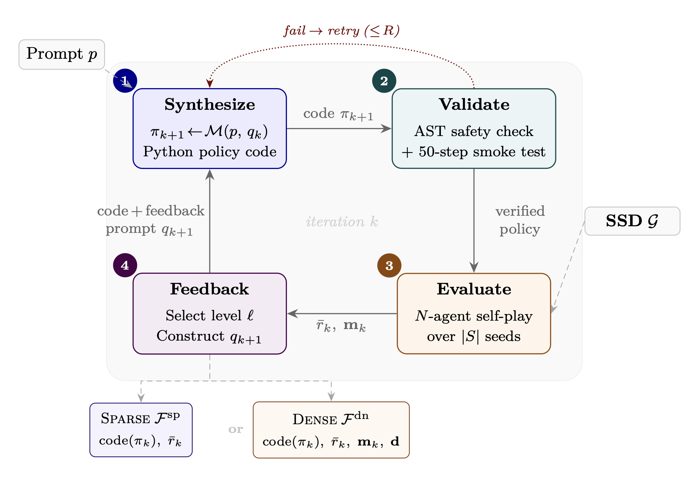

# Autoresearch for Sequential Social Dilemmas

Code for two papers on iterative LLM policy synthesis in multi-agent Sequential Social Dilemmas (SSDs):

1. **Gallego (2026)** — *"Cooperation and Exploitation in LLM Policy Synthesis for Sequential Social Dilemmas"* ([arXiv:2603.19453](https://arxiv.org/abs/2603.19453)). The single-level iterative LLM policy synthesis framework (this repo's **inner loop**).
2. **Gallego (2026)** — *"Discovering Cooperative Pipelines: Autoresearch for Sequential Social Dilemmas"* (pre-print, work in progress; LaTeX source under `paper/`). A two-level framework in which a **researcher agent** autonomously rewrites the synthesis pipeline (prompt, feedback, helpers, iteration logic) to optimize a fixed welfare objective.

<p align="center">
  
  <br>
  <em>Inner loop: an LLM synthesizes a Python policy, which is validated, evaluated in N-agent self-play, and refined via sparse or dense feedback.</em>
</p>

<p align="center">
  
  <br>
  <em>Cleanup environment. Agents (colored dots) must clean waste (brown, left) from the river so apples (green, right) can regrow.</em>
</p>

## Overview

The repo combines two complementary contributions:

- **Inner loop (Paper 1).** An LLM iteratively writes Python policies, evaluates them in $N$-agent self-play, and refines them from sparse (reward only) or dense (reward + social metrics: efficiency, equality, sustainability, peace) feedback. Tested across two SSDs and two frontier LLMs (Claude Sonnet 4.6, Gemini 3.1 Pro).
- **Outer loop (Paper 2).** A *researcher agent* (Claude Opus, run via Claude Code CLI) treats the inner-loop codebase as a modifiable artifact, proposing changes to the prompt $p$, feedback construction $\phi$, helper library $\mathcal{H}$, and iteration logic $\iota$ to maximize a fixed welfare objective $\Phi$ (utilitarian efficiency or Rawlsian maximin) on held-out seeds.

**Key findings:**

*Paper 1 (inner loop):*
- Dense feedback consistently matches or exceeds sparse feedback — social metrics act as a **coordination signal**, not a distraction.
- LLMs discover sophisticated strategies: Voronoi territory partitioning (Gathering), waste-adaptive role assignment (Cleanup).
- Code-level iteration significantly outperforms prompt-level optimization (GEPA baseline).
- Programmatic access enables **reward hacking**.

*Paper 2 (autoresearch):*
- The researcher reliably lifts both Sonnet and Gemini to a shared performance ceiling on Cleanup ($U \approx 3.1$–$3.2$), nearly closing the cross-model gap.
- Beats prompt-only optimization (GEPA) by **2–3×** on Cleanup at matched compute, with the gap widening for weaker policy LLMs.
- Switching the welfare objective from efficiency to maximin causes the researcher to discover **fair duty rotation** mechanisms — a textbook game-theoretic move emerging from autonomous code editing.

## Environments

Two Sequential Social Dilemmas from the multi-agent RL literature:

- **Gathering** ([Leibo et al., AAMAS 2017](https://arxiv.org/abs/1702.03037)): agents collect apples (+1 reward) with a fixed-timer respawn. A tagging beam can temporarily remove rivals. Dilemma: cooperate vs. attack.
- **Cleanup** ([Hughes et al., NeurIPS 2018](https://arxiv.org/abs/1803.08884)): a public goods game where a river accumulates waste and apples only regrow when the river is clean. Cleaning costs effort but benefits all agents. Dilemma: free-ride vs. contribute.

Both environments are Gymnasium-style with `reset()`/`step()` interfaces, egocentric RGB observations, and built-in social metrics (efficiency, equality, sustainability, peace).

## Installation

With [uv](https://docs.astral.sh/uv/):
```bash
uv run llm_self_play.py --help  # auto-installs deps from pyproject.toml
```

Set API keys as environment variables:
```bash
export GEMINI_API_KEY="..."      # for Gemini
```

The Sonnet model is currently only implemented through claude-agent-sdk (i.e., you need to have Claude Code installed and configured locally). The autoresearch outer loop also uses Claude Code (Opus) as the researcher agent.

## Usage

### Environment demo

```bash
# Run Gathering environment self-test (prints map stats, obs shape, social metrics)
uv run gathering_env.py

# Run Cleanup environment self-test
uv run cleanup_env.py
```

### Programmatic policies (no LLM required)

```bash
# Evaluate 7 scenarios comparing BFS / exploitative / cooperative / random agent mixes
uv run gathering_policy.py
```

Three built-in policies:
- **BFS greedy** — shortest path to nearest apple, never beams
- **Exploitative** — beams opponents in path, chases tagged targets, else collects
- **Cooperative** — spatially partitions apples via Voronoi assignment, never beams

### LLM self-play (Paper 1)

```bash
# Gathering, Claude Sonnet, reward-only feedback
uv run llm_self_play.py --game gathering --model claude-sonnet-4-6 --mode reward-only \
    --iterations 3 --map large --n-agents 10

# Cleanup, Gemini, reward+social feedback
uv run llm_self_play.py --game cleanup --model gemini-3.1-pro-preview --mode reward+social \
    --iterations 3 --map large --n-agents 10

# Smoke test (1 iteration, 1 seed)
uv run llm_self_play.py --iterations 1 --eval-seeds 1
```

**Options for reproducing Paper 1 results:**
| Flag | Paper values |
|---|---|
| `--game` | `gathering`, `cleanup` |
| `--model` | `claude-sonnet-4-6`, `gemini-3.1-pro-preview` |
| `--mode` | `reward-only`, `reward+social` |
| `--iterations` | `3` |
| `--map` | `large` |
| `--n-agents` | `10` |
| `--eval-seeds` | `5` (default) |

### Autoresearch / Two-level framework (Paper 2)

The inner loop above is run from a *configurable* pipeline at `pipeline/`, which the outer-loop researcher modifies.

```bash
# Single inner-loop run with the current pipeline (no researcher)
uv run run_inner_loop.py --game cleanup --model gemini-3.1-pro-preview --map large --n-agents 10

# Measure the current pipeline (used by the researcher; reports efficiency or maximin)
./autoresearch/measure.sh dense --metric efficiency
./autoresearch/measure.sh dense --metric maximin

# Launch an autonomous researcher run
# Args: <tag> [feedback_mode] [researcher_model] [policy_model] [metric]
./autoresearch/run_experiment.sh exp1 dense opus gemini-3.1-pro-preview efficiency
./autoresearch/run_experiment.sh exp2 dense opus claude-sonnet-4-6 maximin

# Analyze results across runs (convergence plots)
python3 autoresearch/analyze.py
```

Per-run outputs (policies, metrics, code diffs, history) land in `autoresearch/runs/`; the cross-experiment ledger is `autoresearch/results.tsv`.

The researcher's full instructions are in `autoresearch/program.md`.

### GEPA baseline and verifiers wrapper

To make the previous environment compatible with [verifiers](https://github.com/PrimeIntellect-ai/verifiers/) library, we provide a wrapper on `ssd_verifier_env.py`. While it should be possible to run RL with it, in the papers we only tested it with the GEPA prompt optimizer:

```bash
# Run GEPA for a single game
uv run run_gepa_ssd.py --game gathering

# Custom model or iterations
uv run run_gepa_ssd.py --model gemini-2.5-pro-preview --iterations 5
```

### Q-learning baselines

```bash
# Tabular Q-learning with cooperative reward shaping (Gathering)
uv run gathering_qlearning.py

# Tabular Q-learning with cooperative reward shaping (Cleanup)
uv run cleanup_qlearning.py
```

### Reward hacking demo

```bash
# Demonstrates environment mutation attacks (teleport, disable rivals, purge waste, spawn apples)
uv run demo_env_reward_hack.py
```

## File structure

```
# Frozen inner-loop infrastructure (Paper 1)
gathering_env.py        # Gathering environment (GatheringEnv)
cleanup_env.py          # Cleanup environment (CleanupEnv), extends GatheringEnv
coop_mining_env.py      # Coop Mining (Stag Hunt) environment
gathering_policy.py     # Programmatic policies (BFS, exploitative, cooperative) + helpers
gathering_qlearning.py  # Tabular Q-learning baseline for Gathering
cleanup_qlearning.py    # Tabular Q-learning baseline for Cleanup
llm_self_play.py        # Iterative LLM policy synthesis (Claude / Gemini)
ssd_verifier_env.py     # Verifier wrapper for GEPA integration
run_gepa_ssd.py         # GEPA baseline runner
demo_env_reward_hack.py # Reward hacking attack demonstrations

# Two-level framework (Paper 2)
run_inner_loop.py       # Composes pipeline/ with the frozen inner loop
pipeline/               # Researcher-modifiable: prompts, feedback, helpers, config
autoresearch/           # Outer-loop scripts: measure.sh, run_experiment.sh, program.md, analyze.py
paper/                  # LaTeX source for Paper 2

assets/                 # Environment renders and framework figure
```

## Citation

If this repository is useful in your research, please cite the relevant paper(s):

```bibtex
@misc{gallego2026cooperationexploitationllmpolicy,
      title={Cooperation and Exploitation in LLM Policy Synthesis for Sequential Social Dilemmas},
      author={Víctor Gallego},
      year={2026},
      eprint={2603.19453},
      archivePrefix={arXiv},
      primaryClass={cs.CL},
      url={https://arxiv.org/abs/2603.19453},
}

@misc{gallego2026autoresearchssd,
      title={Discovering Cooperative Pipelines: Autoresearch for Sequential Social Dilemmas},
      author={Víctor Gallego},
      year={2026},
      note={Pre-print, work in progress},
}
```

## License

MIT
